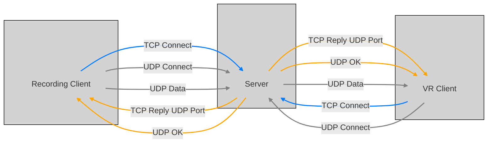

# HoloPiano: VR Piano Instructor
This is the project for Computer Science and Engineering Projects (II), NYCU.
Title: Real-Time Interactive VR System – Remote Piano Classroom 

## Authors
Syuan-Fu Hwang, Yu-Chun Lin, Ting-Yu Chou

